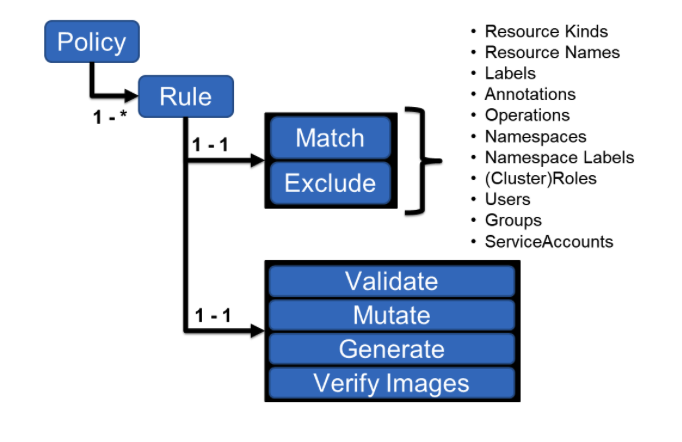

# Kyverno - Core Policy Engine

[Go back of Main Menu](../../navigation.md)

A Kyverno policy is a collection of rules. Each rule consists of a match declaration, an optional exclude declaration, and one of a validate, mutate, generate, or verifyImages declaration. Each rule can contain only a single validate, mutate, generate, or verifyImages child declaration.

## Kyverno Policy Engine

## Kyverno Policy Categories

1. [Validation](./01-validation/README.md)
2. [Mutatation](./02-mutation/README.md)
3. [Generation](./03-generation/README.md)
4. [CleanUp](./04-cleanup/README.md)

> **Note**
> A permuation and combination of these policies can help eliminate the need of writing operators/controllers for many usecases. These would help the firm in
> 1. **Preventing Operator Sprawl**
> 2. **Enhancing manageability** - an controller/operator is replaced by one/multiple manifests
> 3. **Better security** - Operators typically require elevated privilages, avoiding them would improve overall security posture
> 4. **Better resource utilization/cost effective** - we would avoid multiple controller/operator pods running to support the usecases.

[Go back of Main Menu](../../navigation.md)