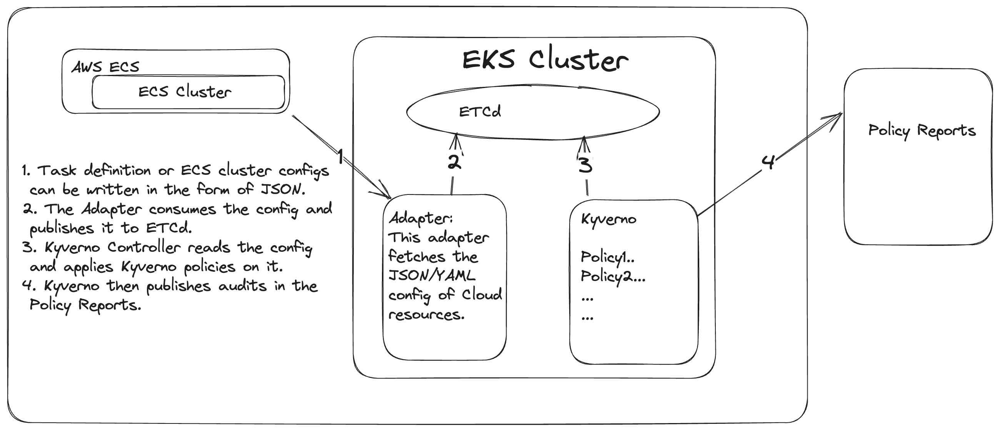

# Features that can be added via Kyverno

Kyverno is a project which is just a YAML generator at its heart and as long as any config can be presented to it in JSON format it can apply policies written to evaluate the config. While from its inception Kyverno has been focussed on Kubernetes as a platform - there is enough demand from its adopters to look beyond kubernetes.

There are ways how you could validate Terraform/ECS configurations today with Kyverno, Nirmata and team is working on a more graceful and native solution towards this as we speak. 

One of the things you could do today can be seen below.

Recently there was a writeup by Chip Zoller from Nirmata on [validating non-Kube resources with Kyverno](https://nirmata.com/2023/07/20/experimental-generic-json-validation-with-kyverno/). This guide covers a step by step process on how you could possibly validate a non-kube resource like ECS or terraform using Kyverno.

